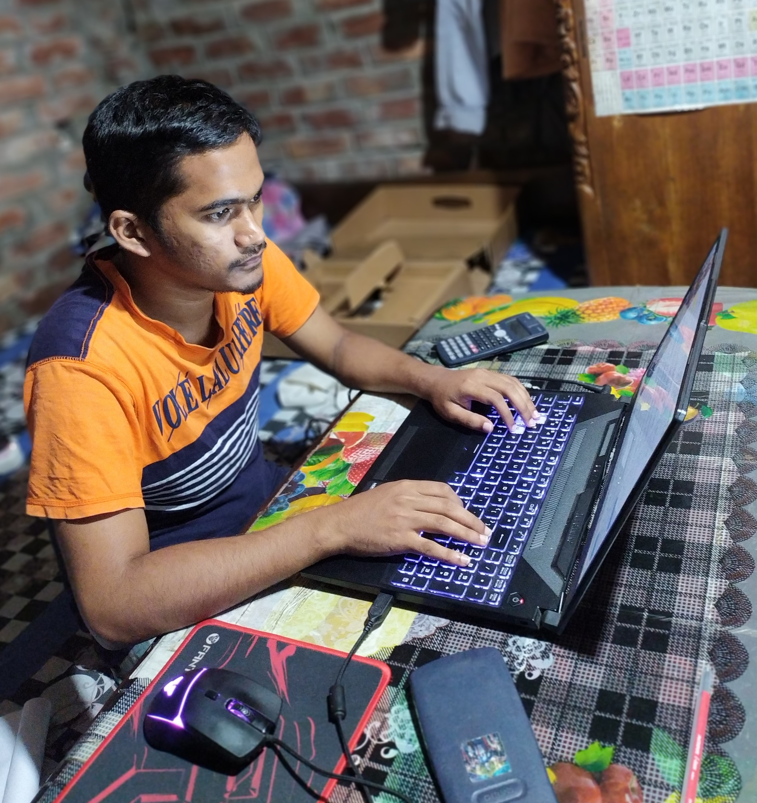

# Hi, I'm Sirajum Monir 👋

## About Me

I'm a **Computer Science and Engineering** student at the University of Chittagong, passionate about **software development**, **web development**, and **IoT projects**.

- 🔭 Currently working on an Arduino project with **flame sensors** and an **I2C LCD** display.
- 🌱 I’m learning **React.js**, **Node.js**, and **full-stack development**.
- 👨‍💻 Check out my [latest frontend project](https://github.com/monir235/local-tutor-hub).

## Educational Projects

### Arduino-Based Fire Fighter Robot
A real-time fire detection system using **KY-026 flame sensors**, **Arduino Uno**, and an **I2C LCD display** to monitor flames and activate a motorized water pump and BO motor to move the robot where fire
is ditected. It will automatically stop before the fire and start the pump which will throw water on the fire and extinguish the fire 

- 🔧 Technologies used: Arduino, C++, Flame Sensors, LCD Display
- 💻 [Project Repository]([https://github.com/monir235/arduino-fire-detection](https://github.com/monir235/Fire_Fighter_Robot))

### Tutor Hub - Local Tutoring Platform
A web application that connects students with local tutors based on their location and subject preferences.

- 🔧 Technologies used: React, Node.js, MySQL
- 💻 [Project Repository](https://github.com/monir235/local-tutor-hub)

## Skills
- Programming Languages: C, C++, Python, JavaScript
- Frameworks: React, Express, Node.js
- Databases: MySQL, SQLite
- Version Control: Git, GitHub

## Connect with Me
- 💼 [LinkedIn]([https://www.linkedin.com/in/monir235](https://www.linkedin.com/in/sirajum-monir-choyon-244b17267/))
- 📧 Email: chayonayon71@gmail.com

